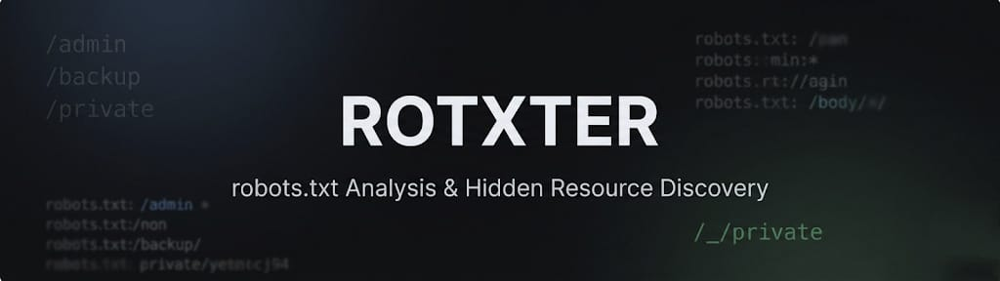
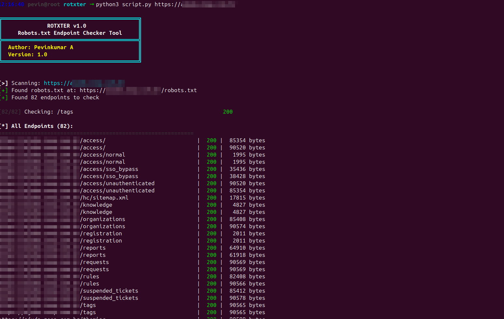

<div align="center">
  <br>
  
  <br>
  <h1>ROTXTER - Robots.txt Endpoint Checker</h1>
  <p>
    <strong>A powerful, multi-threaded tool for analyzing robots.txt files and discovering hidden endpoints</strong>
  </p>
  <br>
  
  <!-- Badges -->
  <p>
    
    
    
    
  </p>
</div>

<br>

## 📋 Table of Contents
- [Overview](#-overview)
- [Features](#-features)
- [Installation](#-installation)
- [Usage](#-usage)
- [Examples](#-examples)
- [Output Format](#-output-format)
- [Options](#-options)
- [Interesting Endpoints Detection](#-interesting-endpoints-detection)
- [Screenshots](#-screenshots)
- [Contributing](#-contributing)
- [License](#-license)
- [Author](#-author)

<br>

## 🎯 Overview

**ROTXTER** is a sophisticated robots.txt analysis tool designed for security researchers, penetration testers, and web developers. It automatically fetches robots.txt files from target websites, extracts all disallowed/allowed paths, and performs comprehensive endpoint checking to discover potentially sensitive or hidden resources.

<br>

<div align="center">
  
  <br>
  <p><em>ROTXTER scanning in progress with colorful output</em></p>
</div>

<br>

## ✨ Features

### Core Capabilities
- **🤖 Robots.txt Fetching** - Automatically retrieves robots.txt from target domains
- **🔍 Endpoint Extraction** - Parses Disallow, Allow, and Sitemap directives
- **⚡ Multi-threaded Scanning** - Configurable thread count for faster results
- **📊 Status Code Analysis** - Checks HTTP status codes for each endpoint
- **📏 Page Size Detection** - Records response sizes for content analysis

### Advanced Features
- **🎨 Color-coded Output** - Beautiful terminal output with status-based colors
- **🔬 Interesting Endpoint Detection** - Automatically identifies potentially sensitive paths
- **📁 Multiple Input Sources** - Single URL or bulk scanning from file
- **💾 Export Capabilities** - Save results in TXT or JSON format
- **🚫 No External Dependencies** - Uses only Python standard library

### Output Features
- **📈 Progress Tracking** - Real-time scanning progress
- **🎯 Interesting-only Mode** - Filter results to show only suspicious endpoints
- **🔄 URL Normalization** - Automatically handles various URL formats
- **📝 Clean Formatting** - Well-structured, easy-to-read output

<br>

## 🔧 Installation

### Prerequisites
- Python 3.6 or higher
- No external dependencies required!

### Quick Install
```bash
# Clone the repository
git clone https://github.com/pevinkumar10/rotxter.git

# Navigate to directory
cd rotxter

# Run directly
python3 rotxter.py
```

<br>

## 🚀 Usage

### Basic Syntax
```bash
python rotxter.py [target] [options]
```

### Common Use Cases

#### Single Target Scan
```bash
python rotxter.py example.com
```

#### Multiple Targets from File
```bash
python rotxter.py -f targets.txt
```

#### Custom Thread Count
```bash
python rotxter.py example.com -t 20
```

#### Export Results
```bash
python rotxter.py example.com -o results.txt
```

#### JSON Output
```bash
python rotxter.py example.com -o results.json --format json
```

#### Interesting Endpoints Only
```bash
python rotxter.py example.com --interesting-only
```

#### Disable Colors
```bash
python rotxter.py example.com --no-color
```

#### Custom Robots.txt File
```bash
python rotxter.py example.com -r custom_robots.txt
```

<br>

## 📚 Examples

### Example 1: Basic Scan
```bash
$ python rotxter.py google.com
```

**Output:**
```
╔═════════════════════════════════════════════╗
║              ROTXTER v1.0                   ║
║     Robots.txt Endpoint Checker Tool        ╠
║  Author: Pevinkumar A                       ║
║  Version: 1.0                               ║
╚═════════════════════════════════════════════╝

[>] Scanning: https://google.com
[+] Found robots.txt at: https://google.com/robots.txt
[+] Found 15 endpoints to check

[1/15] Checking: /search                                200
[2/15] Checking: /images                                403
[3/15] Checking: /news                                  200
...
```

### Example 2: Interesting Endpoints Detection
```bash
$ python rotxter.py example.com --interesting-only

[*] Interesting Endpoints (3):
============================================================
https://example.com/admin                               | 200 |   5120 bytes
https://example.com/backup.zip                          | 403 |      0 bytes
https://example.com/.git/config                         | 200 |   1024 bytes
```

<br>

## 📊 Output Format

### Standard Output (Colored)
```
https://example.com/path                               | 200 |   5120 bytes
https://example.com/private                            | 403 |      0 bytes
https://example.com/old-page                           | 301 |      0 bytes
https://example.com/deleted                            | 404 |      0 bytes
```

<br>

## ⚙️ Options

| Option | Description | Default |
|--------|-------------|---------|
| `target` | Target URL (e.g., google.com) | Required |
| `-f, --file` | Input file containing URLs | None |
| `-t, --threads` | Number of threads | 10 |
| `-o, --output` | Output file for results | None |
| `--format` | Output format (txt/json) | txt |
| `--no-color` | Disable colored output | False |
| `--interesting-only` | Show only interesting endpoints | False |
| `-r, --robots` | Custom robots.txt file path | None |

<br>

## 🎯 Interesting Endpoints Detection

ROTXTER automatically identifies potentially sensitive endpoints based on:

### Pattern Matching
- **Admin Panels**: admin, dashboard, console
- **Authentication**: login, signin, auth
- **Configuration**: config, settings, .env
- **Backup Files**: backup, dump, sql
- **Version Control**: .git, .svn
- **API Endpoints**: api, v1, graphql
- **Development**: dev, test, staging
- **Debug Info**: debug, trace, status

### Status Code Analysis
- **200 OK** - Accessible endpoints
- **403 Forbidden** - Restricted but discovered
- **401 Unauthorized** - Authentication required
- **500 Error** - Potential misconfigurations

<br>

## 🤝 Contributing

Contributions are welcome! Here's how you can help:

1. **Fork** the repository
2. **Create** a feature branch (`git checkout -b feature/amazing-feature`)
3. **Commit** your changes (`git commit -m 'Add amazing feature'`)
4. **Push** to the branch (`git push origin feature/amazing-feature`)
5. **Open** a Pull Request
   
<br>

## 📄 License

This project is licensed under the MIT License - see the [LICENSE](./LICENSE) file for details.

<br>

## 👤 Author(s)
- [@pevinkumar10](https://github.com/yourusername)

<br>

---

<div align="center">
  <p>
    <strong>ROTXTER</strong> - Making robots.txt analysis great again! 🚀
  </p>
  <p>
    If you find this tool useful, please give it a ⭐ on GitHub!
  </p>
  <br>
  <p>
    
  </p>
</div>
